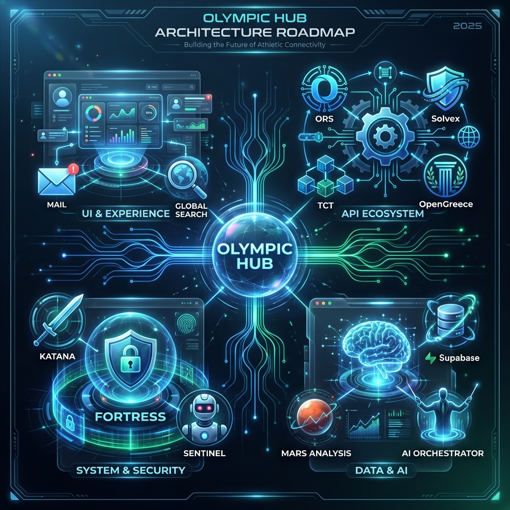

# 🏗️ Olympic Hub Architecture Overview

Ovaj dokument pruža visokonivo pregled arhitekture i strukture **Olympic Hub** aplikacije.

## 🗺️ Arhitektonska Mapa

---

## 📂 Tehnička Struktura Projekta

Aplikacija je dizajnirana kao modularni ekosistem zasnovan na React-u, podeljen na četiri glavna funkcionalna stuba:

### 1. 🖥️ UI & Korisničko Iskustvo (`/src/pages` & `/src/modules`)
Centralni interfejs za operacije:
*   **Dashboard**: Glavni kontrolni centar sa uvidom u ključne metrike.
*   **Global Hub Search**: Unificirani interfejs za pretragu smeštaja i letova kroz različite API provajdere.
*   **Olympic Mail**: Napredni komunikacioni modul sa persistence podrškom.
*   **Reservations**: Sistem za upravljanje statusima, uplatama i dokumentacijom.
*   **Reservation Architect**: Specijalizovani alat za manuelno i automatsko kreiranje ponuda.

### 2. 🔌 API Ekosistem (`/src/services`)
Integracioni sloj koji unifikuje različite standarde (XML, JSON, SOAP):
*   **ORS (Open Reservation System)**: Glavna veza za hotelske rezervacije.
*   **OpenGreece**: Implementacija OTA (Open Travel Alliance) standarda za grčko tržište.
*   **Solvex**: Servis za Bugarsku i regionalne hotele.
*   **TCT (Travel Connection Technology)**: Globalna B2B integracija.
*   **Amadeus**: Backbone za avio saobraćaj i globalnu distribuciju.

### 3. 🛡️ Sistem i Sigurnost (`/src/modules/system`)
Zaštitni i administrativni slojevi:
*   **Fortress**: Robusna kontrola pristupa i nivoa ovlašćenja (User Levels).
*   **Katana**: Alat za dubinsko čišćenje i optimizaciju baze podataka.
*   **Sentinel**: Monitoring mrežnog saobraćaja i "health check" API servisa u realnom vremenu.
*   **Deep Archive**: Sistem za arhiviranje istorijskih podataka uz visoku kompresiju.

### 4. 🧠 Podaci i AI Inteligencija (`/src/stores` & `/src/modules/ai`)
Analitički i logički centar:
*   **Supabase**: Backend persistence (DB, Auth, Storage).
*   **Mars Analysis**: Inteligentna analiza produkcije i prodajnih rezultata.
*   **AI Orchestrator**: Centralna komponenta koja integriše LLM modele za automatizaciju procesa.
*   **Global Stores**: Brzi state management preko `Zustand` biblioteke.

---

## 🚀 Tehnološki Stack
*   **Jezgro**: React 18, TypeScript, Vite.
*   **Dizajn**: Vanilla CSS + Glassmorphism UI dizajn sistem.
*   **Animacije**: Framer Motion.
*   **Ikone**: Lucide React.
*   **Backend**: Supabase (PostgreSQL + Auth).
