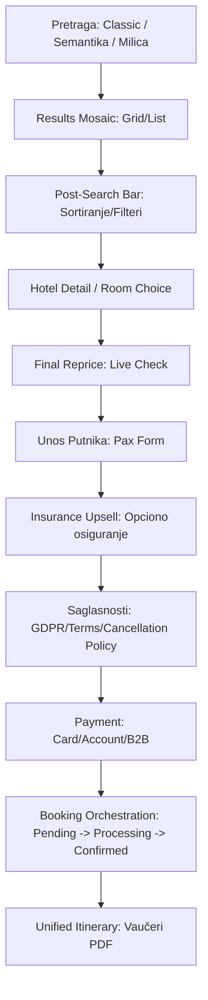

# 📘 PrimeSmartSearch V6 — Tehnička Dokumentacija i Putokaz (Roadmap)

Ovaj dokument služi kao "North Star" (putokaz) za razvoj šeste verzije (V6) unificiranog sistema pretrage. PrimeSmartSearch V6 spaja vrhunski **UX interaktivni dizajn** iz Verzije 1, **robusnu poslovnu logiku** iz NeoPremium specifikacije i **hibridni model inventara** (Live API + Manual Entry + Charter Allotments).

---

## 1. Arhitektura Sistema (Fusion Architecture)

V6 koristi **Modularni Frontend** povezan na **Unified API Orchestrator**.

*   **State Management**: `Zustand` (`stores/useSearchStore.ts`) — Upravlja svim parametrima pretrage, filtrima i istorijom.
*   **Unified API Layer**: Jedinstveni ulaz (`Orchestrator`) koji interno komunicira sa:
    *   Eksternim API-jima (Solvex, Amadeus, Skyscanner, itd.).
    *   Lokalnom bazom (Manuelni unosi, sopstveni hoteli).
    *   Čarter menadžerom (Zakupi mesta / Allotments).
*   **Service Workers**: Za "Reprice" i "Availability" provere u realnom vremenu.

---

## 2. Moduli Pretrage (8 Ključnih Tabova)

Sistem podržava sledećih 8 tipova usluga sa mogućnošću promene redosleda:

1.  **🛏️ Smeštaj (Stays)**: Hibridni prikaz (Solvex API + Direktni zakupi).
2.  **✈️ Letovi (Flights)**: Redovne linije via GDS/API + Čarter opcije.
3.  **🚗 Renta-car (Cars)**: API integracija sa rent-a-car provajderima.
4.  **📦 Paketi (Packages)**: 
    *   *Dynamic*: Live Flight + Live Hotel + Transfer.
    *   *Fixed*: Charter Seat + Manual Hotel + Transfer.
5.  **🎟️ Izleti (Things to do)**: Događaji i lokalni izleti (vaši i partnerski).
6.  **🚢 Krstarenja (Cruises)**: Pretraga brodskih ruta sa pre-stay/post-stay hotelima.
7.  **🎫 Čarteri (Charters)**: Prodaja mesta na vašim zakupljenim avionima (Allotment logic).
8.  **🌍 Putovanja (Tours)**: Grupna putovanja (vaš kôstur puta + Live Flight/Hotel feed).

---

## 3. Logika Pretrage (Hybrid Engine)

Sistem orkestrira rezultate na osnovu dva izvora podataka:

*   **API Inventory**: Live podaci dobavljača (Solvex, Amadeus).
*   **Manual Inventory (Vaš Inventar)**: Hoteli, cene i čarteri koje ste ručno uneli. Ovi podaci imaju prioritet u prikazu ili "Prime" oznaku.
*   **Charter-Hotel-Transfer Connection**: Ako sistem nađe Čarter let za tu destinaciju, automatski ga "pakuje" sa vašim hotelom i transferom u toj regiji (Fiksni Aranžman).

---

## 4. Design System (Expedia Meets Ferrari)

### ⚪ Light Mode (Premium Silver)
*   **Background**: Svetlo srebrna (`#F0F2F5`).
*   **Text/Numbers**: Tamno teget (`#0F172A`).
*   **Actions (Buttons/Tabs)**: Tamno teget pozadina + Bela slova.
*   **Critical Alerts**: Tamno crveni tag (`#991B1B`) + Bela slova.

### 🔵 Dark Mode (Deep Navy)
*   **Color Palette**: Navy baza (bez čiste crne ili sive).
*   **Background**: Deep Navy (`#1B2A4E`).
*   **Highlights**: Silver-blue detalji.

---

## 5. User Flow: Od Pretrage do Vaučera

---

## 6. UX Standardi

*   **Kalendar**: Expedia-style date picker sa cenama po danima.
*   **Occupancy**: Modul za sobe i decu identičan Expediji (čist i intuitivan).
*   **Availability Badges**:
    *   ⚡ **Instant Book** (Munja): Odmah potvrđeno.
    *   ❓ **On Request** (Plavi upitnik): Čeka se potvrda operatera.
*   **Transparetnost**: Prikaz **Uslova otkaza** (Cancellation Policy) vizuelno markiran pre same rezervacije.

---

## 7. Tehničke Smernice za Implementaciju

1.  **Zustand Store**: Prvo implementirati `useSearchStore` za stabilan izvor podataka.
2.  **Modular CSS**: Koristiti `PrimeSmartSearch.css` sa CSS varijablama za laku promenu tema.
3.  **Unified API Interface**: Svaki tab mora implementirati isti Interface za pretragu kako bi `Orchestrator` mogao da ih poziva.
4.  **Error Handling**: Neo style — ako let padne tokom orkestracije, uradi rollback hotela.

---

> [!IMPORTANT]
> **Ovaj dokument je živa materija.** Svaka promena u biznis logici ili API-ju mora biti prvo evidentirana ovde pre implementacije.
